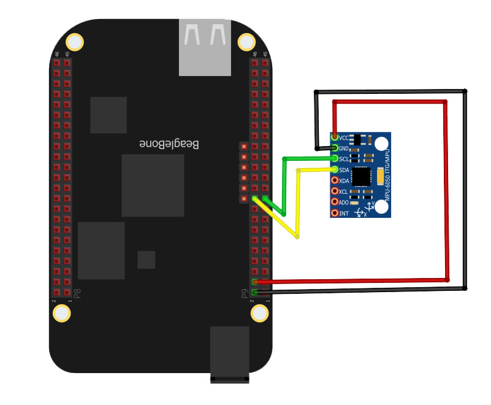
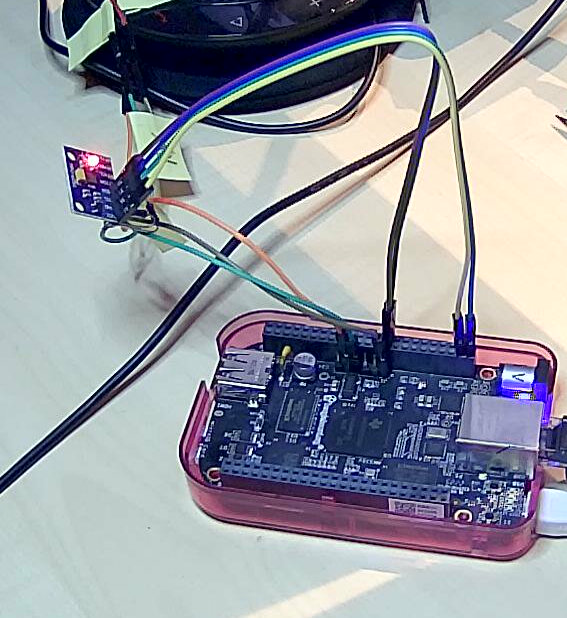

# BeagleBone Black

This page describes usage examples for different periperals attached
to the Deegle Linux running on a BeagleBone Black hardware.

## Using I2C busses

The Deegle Linux BeagleBone Black image enables the `44e0b000.i2c`, `i2c-0`,
and  `4819c000.i2c`, `i2c-2`, devices.
The `44e0b000.i2c`, `i2c-0`, is not accessible on the header pins.

### Interacting with I2C peripherals

The `i2cdetect` can be used to scan for devices.

```bash
root@beaglebone:~# i2cdetect -r 2
WARNING! This program can confuse your I2C bus, cause data loss and worse!
I will probe file /dev/i2c-2 using receive byte commands.
I will probe address range 0x08-0x77.
Continue? [Y/n] y
     0  1  2  3  4  5  6  7  8  9  a  b  c  d  e  f
00:                         -- -- -- -- -- -- -- -- 
10: -- -- -- -- -- -- -- -- -- -- -- -- -- -- -- -- 
20: -- -- -- -- -- -- -- -- -- -- -- -- -- -- -- -- 
30: -- -- -- -- -- -- -- -- -- -- -- -- -- -- -- -- 
40: -- -- -- -- -- -- -- -- -- -- -- -- -- -- -- -- 
50: -- -- -- -- -- -- -- -- -- -- -- -- -- -- -- -- 
60: -- -- -- -- -- -- -- -- 68 -- -- -- -- -- -- -- 
70: -- -- -- -- -- -- -- --    
```

The scan shows the connected acceeration sensor
[MPU6050](https://www.elektronik-kompendium.de/sites/praxis/bauteil_mpu6050-imu.htm)
which is using address 0x68.

### MPU6050 acceleration sensor

I use the MPU6050 sensor connected to the `4819c000.i2c` (`i2c-2`) bus.





The relevant registers are:

- ACCEL_XOUT_H:	0x3B
- ACCEL_XOUT_L:	0x3C
- ACCEL_YOUT_H:	0x3D
- ACCEL_YOUT_L:	0x3E
- ACCEL_ZOUT_H:	0x3F
- ACCEL_ZOUT_L:	0x40
- GYRO_XOUT_H:	0x43
- GYRO_XOUT_L:	0x44
- GYRO_YOUT_H:	0x45
- GYRO_YOUT_L:	0x46
- GYRO_ZOUT_H:	0x47
- GYRO_ZOUT_L:	0x48

For more details, see
[full register map](https://invensense.tdk.com/wp-content/uploads/2015/02/MPU-6500-Register-Map2.pdf)

#### Reading MPU6050 values

- Wake up the MPU6050: Write 0 to the PWR_MGMT_1 register (0x6B): `i2cset 2 0x68 0x6B 0`

```bash
root@beaglebone:~# i2cset 2 0x68 0x6B 0
WARNING! This program can confuse your I2C bus, cause data loss and worse!
I will write to device file /dev/i2c-2, chip address 0x68,
data address 0x6b, data 0x00, mode byte.
Continue? [Y/n] y
```

- Get sensor values:

```bash
#!/bin/sh

BUS="2"
ADDRESS="0x68"

function get_value() {
	HX=$(i2cget -y $BUS $ADDRESS $1)
	LX=$(i2cget -y $BUS $ADDRESS $2)
	HD=$(printf "%d\n" $HX)
	LD=$(printf "%d\n" $LX)
	VAL=$(( $HD*16 + $LD ))
	echo $VAL
}

i2cset -y $BUS $ADDRESS 0x6B 0

ACCEL_X=$(get_value "0x3B" "0x3C")
echo "Acceleration X: $ACCEL_X"

ACCEL_Y=$(get_value "0x3D" "0x3E")
echo "Acceleration Y: $ACCEL_Y"

ACCEL_Z=$(get_value "0x3F" "0x40")
echo "Acceleration Z: $ACCEL_Z"

GYRO_X=$(get_value "0x43" "0x44")
echo "Gyroscope X: $GYRO_X"

GYRO_Y=$(get_value "0x45" "0x46")
echo "Gyroscope Y: $GYRO_Y"

GYRO_Z=$(get_value "0x47" "0x48")
echo "Gyroscope Z: $GYRO_Z"
```

### VL53L0X Time of Flight Distance Sensor

The VL53L0X is a time of flight laser distance sensor.
It can be powered wihth 3.3V, and the `XSHUT` pin
needs to be pulled up to enable the sensor.

For more details, see 
[AZDelivery documentation](https://cdn.shopify.com/s/files/1/1509/1638/files/VL53L0X_Time_of_Flight_Sensor_Datenblatt_AZ-Delivery_Vertriebs_GmbH.pdf?v=1608104673)
and [datasheet](https://www.st.com/resource/en/datasheet/vl53l0x.pdf)

The I2C address of the sensor is `0x29`.


## Using GPIO pins


## Further reading

- The [BeagleBone Cookbook](https://docs.beagleboard.org/books/beaglebone-cookbook/index.html)
  also gives great examples.
- [BeagleBone Black I2C Tutorial](https://www.teachmemicro.com/beaglebone-black-i2c-tutorial/)
- [Beaglebone Black MPU6050 Interfacing: I2C Tutorial Part 2](https://www.teachmemicro.com/beaglebone-black-mpu6050-i2c-tutorial-part-2/)